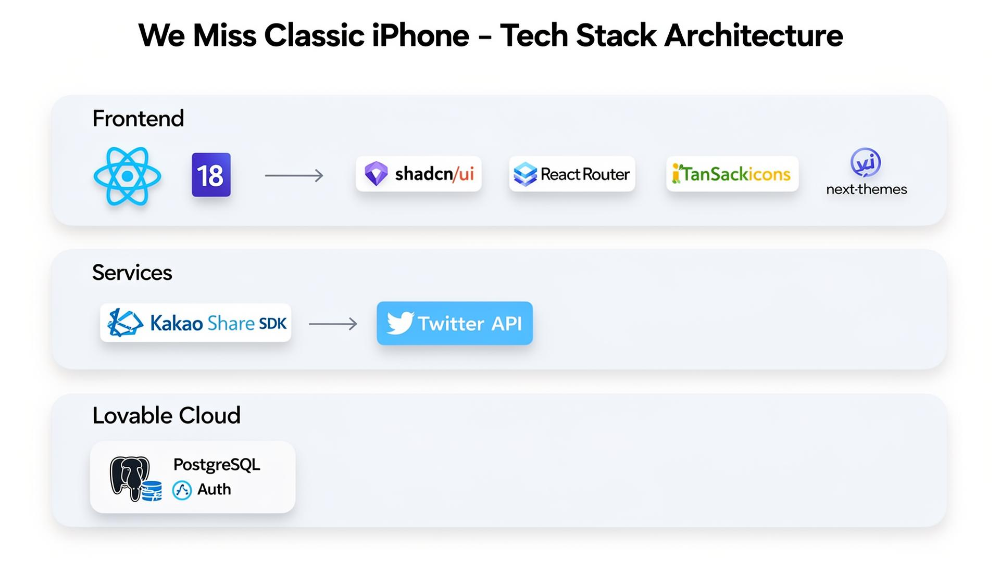

# We Miss Classic iPhone: Bring back the classic iPhone.

 

## 📱 프로젝트 소개

> **"홈 버튼이 있던 그 시절의 아이폰, 다시 만나고 싶지 않으신가요?"**

**We Miss Classic iPhone**은 클래식 아이폰을 그리워하는 사람들의 마음을 모으는 투표 & 공유 서비스입니다.

홈 버튼, 하나의 카메라, 깔끔한 일자 베젤, 이어폰 단자, 그리고 박스를 열면 들어있던 이어폰과 충전기까지 — 그 시절 아이폰의 단순하면서도 완벽했던 디자인을 그리워하는 사람들이 ❤️ 하나로 마음을 전할 수 있습니다.

한국어, 영어, 일본어, 중국어 4개 언어를 지원하며, 다크모드, 카카오톡/X(Twitter) 공유 기능을 제공합니다.

 

## 🚀 배포 주소

> **🌐 프론트엔드 주소:** https://we-miss-classic-iphone.lovable.app  

> **⚙️ 백엔드 주소:** Lovable Cloud (내장 백엔드)  

 

## 👫 팀원 소개

| 지니(김현진) |
|:----------------:|
|   |
| [@tellgeniewish](https://github.com/tellgeniewish) |

 

## 💻 사용 기술 스택

| 분류 | 기술 |
|------|------|
| Language | TypeScript |
| Frontend Framework | React 18 |
| Build Tool | Vite |
| Styling | Tailwind CSS, shadcn/ui |
| Routing | React Router v6 |
| State Management | TanStack React Query |
| Form | React Hook Form, Zod |
| UI Icons | Lucide React |
| Theme | next-themes (다크모드) |
| i18n | 자체 구현 (ko/en/ja/zh) |
| Dev Tool | Lovable (AI Vibe Coding) |
| Backend / Auth | Lovable Cloud (Supabase) |
| Database | PostgreSQL |
| Cloud | Lovable Cloud |
| Share SDK | Kakao JS SDK, X(Twitter) Intent |

 

## 🏗️ 아키텍처

  

 

## 📂 주요 기능

- ❤️ **그리움 투표** — 로그인 후 클래식 아이폰에 대한 마음을 전할 수 있습니다
- 🌍 **다국어 지원** — 한국어, 영어, 일본어, 중국어
- 🌙 **다크모드** — 시스템 설정 연동 + 수동 전환
- 🔗 **공유** — 링크 복사, X(Twitter), 카카오톡
- 👤 **마이페이지** — 계정 관리 및 회원 탈퇴
- 🔐 **인증** — 이메일 기반 회원가입/로그인, 비밀번호 재설정
